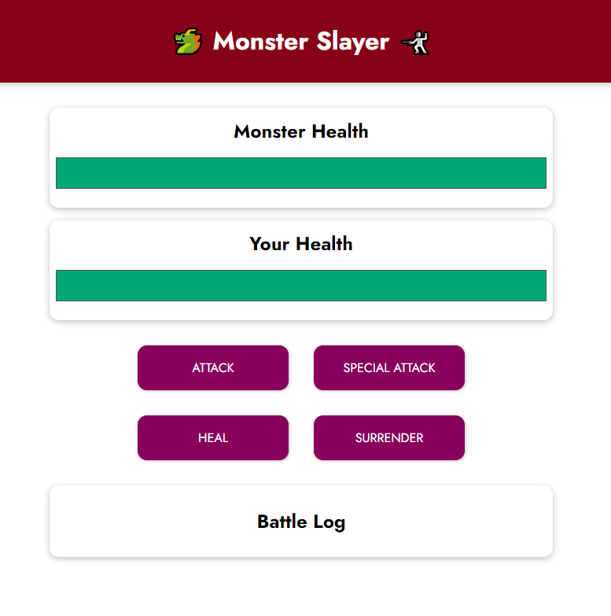

# Monster Slayer Game

## Overview
I'm Learning Vue.js 3!
Monster Slayer is a simple, interactive game built with Vue.js as part of an exercise project from Maximilian Schwarzmüller's Udemy Course: [Vue - The Complete Guide].
This project demonstrates basic concepts of Vue.js, including reactivity, event handling, and conditional rendering.
Players battle a monster, with options to attack, perform a special attack, heal, or surrender.

## Gameplay
- **Attack**: Deals random damage to the monster.
- **Special Attack**: A stronger attack available every three rounds.
- **Heal**: Restores a random amount of player health.
- **Surrender**: Ends the game with the monster as the winner.

## Project Setup
This game is developed using Vue.js 3 and basic HTML/CSS. 

### Running Locally
1. Clone the repository.
2. Open `index.html` in a web browser.

### Online Version
You can also play the game online, hosted on GitHub Pages: [Monster Slayer Game](https://antqua.github.io/MonsterSlayerGame/)

## Technologies Used
- HTML
- CSS
- JavaScript
- Vue.js 3

## Game Interface

## License
This project is [MIT licensed](LICENSE).

## Contact
- [LinkedIn](https://www.linkedin.com/in/antonio-quaresma/)

